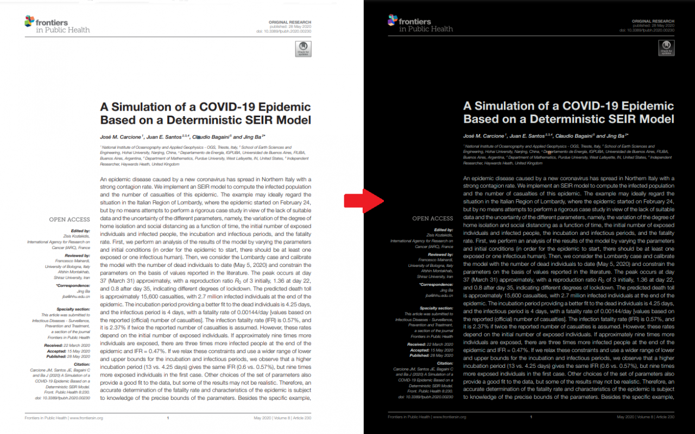
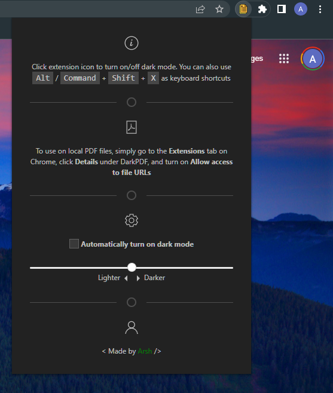
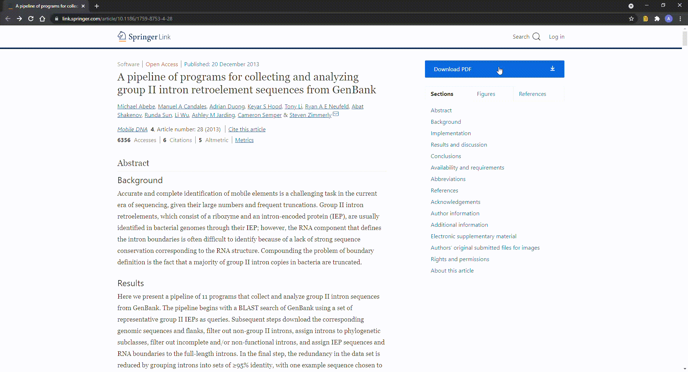

# DarkPDF - dark mode for PDFs in Google Chrome

## General information

I use Chrome's native PDF viewer a lot, especially during the night. As an avid dark mode user, I was disappointed to learn that Chrome does not have a built-in dark mode feature. So I decided to dip my toes into the world of Chrome extensions and implement my own dark mode feature for PDF viewing. This is the result.

The extension is very simple. Here is the interface:

Have the PDF open in an active tab on Chrome, then simply click the extension icon or use the keyboard shortcut to turn the dark mode on or off.

The extension also offers automatic dark mode. While the feature is on, anytime you visit a PDF during your web browsing, dark mode will automatically be applied without needing to click the extension icon for maximum convenience. Automatic preference will be synced to user's Google account if logged in, otherwise it will only be synced locally. Additionally, you have the option to choose 3 different intensities of the dark mode.

To use this extension on local PDF files, you will have to give DarkPDF manual access to file URLs. Simply go to the Extensions tab on Chrome, click "Details" under DarkPDF, and turn on "Allow access to file URLs". 

Here is a demo:

## How to install

Simply install the extension via the Chrome Web Store [here](https://chrome.google.com/webstore/detail/darkpdf/cfemcmeknmapecneeeaajnbhhgfgkfhp)

You can also add the extension manually. Download this repository as a ZIP file, extract it to a folder and load it unpacked to your Chrome browser. 

Here are the [instructions](https://webkul.com/blog/how-to-install-the-unpacked-extension-in-chrome/) in details.

## Feedback

I hope this extension will be as useful to you as it has been to me. If you encounter any bugs, issues or you have feedback in general, please feel free to leave a ticket in the issues section of this repository!

## Built with

* [Chrome Extensions API](https://developer.chrome.com/docs/extensions/reference/) - build your own Chrome extensions using their powerful library
* [UIKit](https://getuikit.com/) - for extension user interface

## Attributions

* [Extension icon and interface image](https://iconscout.com) - free, high definition icons and images
